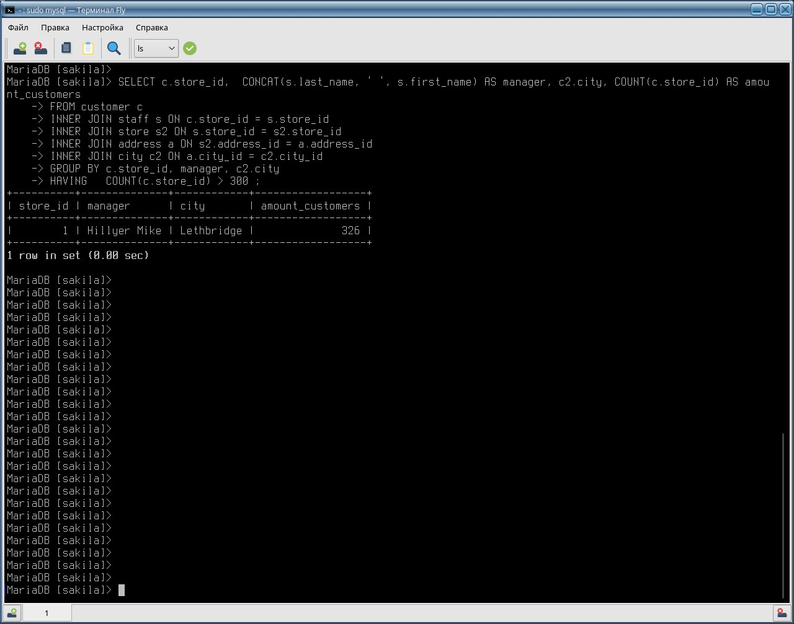
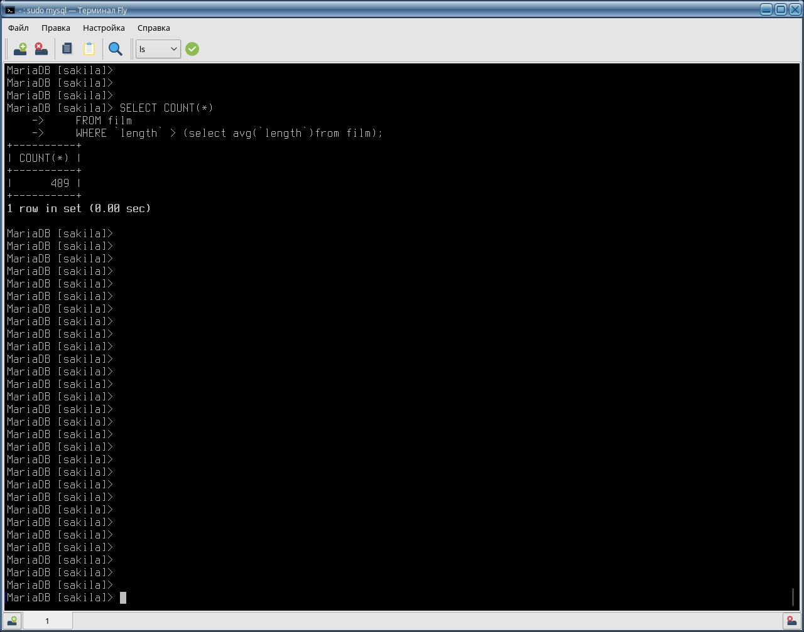
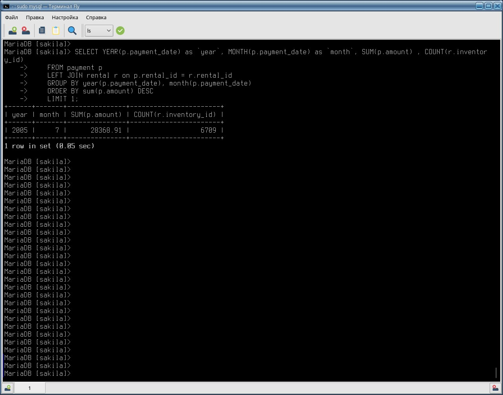
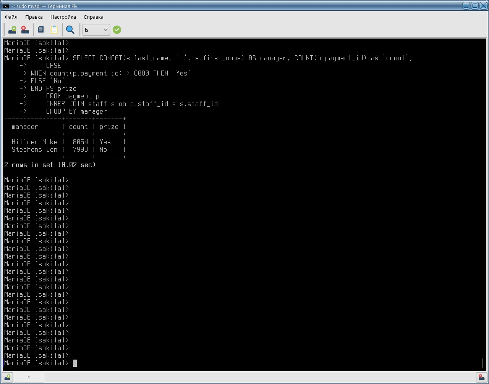

# Домашнее задание к занятию "`«SQL. Часть 2»`" - `Дьяконов Алексей`

# Задание 1.

```
SELECT c.store_id,  CONCAT(s.last_name, ' ', s.first_name) AS manager, c2.city, COUNT(c.store_id) AS amount_customers
FROM customer c
INNER JOIN staff s ON c.store_id = s.store_id
INNER JOIN store s2 ON s.store_id = s2.store_id
INNER JOIN address a ON s2.address_id = a.address_id 
INNER JOIN city c2 ON a.city_id = c2.city_id 
GROUP BY c.store_id, manager, c2.city
HAVING   COUNT(c.store_id) > 300 ;
```
-


# Задание 2.


```
    SELECT COUNT(*)
    FROM film 
    WHERE `length` > (select avg(`length`)from film);
```

-


# Задание 3.

```
    SELECT YEAR(p.payment_date) as `year`, MONTH(p.payment_date) as `month`, SUM(p.amount) , COUNT(r.inventory_id)
    FROM payment p
    LEFT JOIN rental r on p.rental_id = r.rental_id
    GROUP BY year(p.payment_date), month(p.payment_date)
    ORDER BY sum(p.amount) DESC
    LIMIT 1;
```

-

# Задание 4.
```
    SELECT CONCAT(s.last_name, ' ', s.first_name) AS manager, COUNT(p.payment_id) as `count`,
    CASE
	WHEN count(p.payment_id) > 8000 THEN 'Yes'
	ELSE 'No'
	END AS prize
    FROM payment p
    INNER JOIN staff s on p.staff_id = s.staff_id 
    GROUP BY manager;
```

-